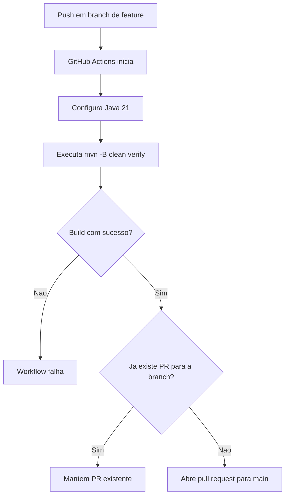

# Pessoas API

API REST em Java com Spring Boot 3 para cadastrar uma pessoa que e usuaria do sistema e autentica por e-mail e senha.

## Endpoint

### Cadastrar pessoa

`POST /api/pessoas`

Corpo da requisicao:

```json
{
  "nome": "Maria Silva",
  "email": "maria@example.com",
  "senha": "senha1234"
}
```

Resposta `201 Created`:

```json
{
  "id": "4e8a7252-1d64-4c5c-a982-71ef45eb0fed",
  "nome": "Maria Silva",
  "email": "maria@example.com",
  "criadaEm": "2026-05-06T10:00:00-03:00"
}
```

A senha e recebida no cadastro, mas nao e retornada na resposta.

## Arquitetura

O projeto segue arquitetura hexagonal:

- `domain`: modelo e excecoes de negocio.
- `application/port/in`: portas de entrada e comandos dos casos de uso.
- `application/port/out`: portas de saida usadas pela aplicacao.
- `application/usecase`: implementacao dos casos de uso.
- `adapter/in/web`: controller REST, DTOs e tratamento de erros HTTP.
- `adapter/out/persistence`: adaptador de persistencia em memoria.
- `adapter/config`: composicao dos beans Spring.

## Fluxo do workflow



## Executar

```bash
mvn spring-boot:run
```

## Testar

```bash
mvn test
```

# codex-use-example
